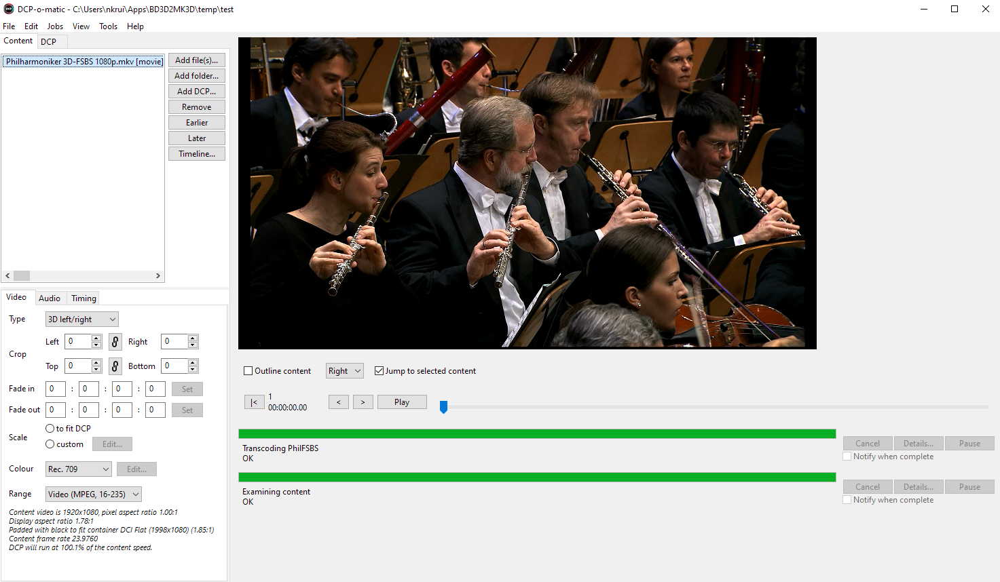

# Digital Cinema Package (DCP)

Convert files to DCP standard format for digital projection.

## 3D

Convert MVC-encoded stereoscopic 3D content, such as royalty-free 3D Blu-rays, to MJPEG-encoded DCP format.

### High-level overview:

1. [MakeMKV](https://www.makemkv.com/)

2. [BD3D2MK3D](https://download.videohelp.com/r0lZ/BD3D2AVS/#current)

3. [DCP-o-matic](https://dcpomatic.com/get-started.php)

#### Use MakeMKV to create a bit-perfect source .MKV file

1. [Download](https://www.makemkv.com/download/) and install MakeMKV

2. Activate (using [beta key](https://forum.makemkv.com/forum/viewtopic.php?t=1053) if you haven't purchased it, but it is worth the price IMO)

3. Create a .MKV file from the source disc, making sure to select the stereo 3D video track

#### Use BD3D2MK3D to create an intermediate file

Install AviSynth+:

https://github.com/pinterf/AviSynthPlus/releases ← I used this but it seems like it’s older
https://github.com/AviSynth/AviSynthPlus/releases 

Install and run BD3D2MK3D:

https://download.videohelp.com/r0lZ/BD3D2AVS/#current

Use the MKV 3D mode, not the Blu-ray 3D mode:

Include no subtitles, and only the main audio stream:

Name the movie

Configure the `AviSynth` script in the `Options` tab:
- For `Stereoscopy`, use `Full - Side By Side` 
- For `x264`, use `CRF` around `18` to preserve as much visual quality as possible
- Mux to MKV file
- Define a valid temp directory
  - Needs to be a full/non-relative path
  - Can require 3-4x the space of the original file to complete operation

That also generates the script to encode: `__ENCODE_3D_LAUNCHER.cmd`

This ran at approximately 50fps on an 8-core cpu, thus taking about half the film’s runtime to finish.

#### Use DCP-o-matic to encode the source into a DCP

Make sure to set to `3D left/right`:

Scope usually requires additional adjustments to crop and fit:

Then go to the DCP settings and configure them accordingly:

Pack into a DCP:

This is processor intensive and ran at approximately 25fps, thus taking about as long as the film’s runtime to finish.

Result will have extra black padding on the sides to ensure it matches the theatrical 1.85 flat aspect ratio container instead of Blu-ray 1.78. In the DCP, the configuration [should be as-expected for 3D](https://en.easydcp.com/support-faq.php?id=24&p=which-aspect-ratio-should-i-choose-for-my-dcp).

