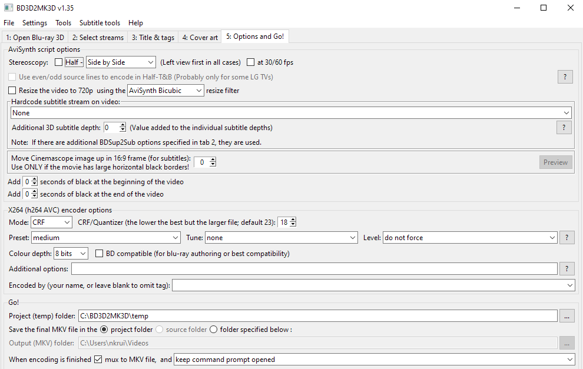

# Digital Cinema Package (DCP)

Package DCP standard format files for digital projection.

## Software

* [DCP-o-matic](https://dcpomatic.com/get-started.php)
  * Windows, Mac, and Linux
  * Create DCP files from source material in other formats

* [MakeMKV](https://www.makemkv.com/)
  * Windows and Mac
  * Retrieve media stored on disc formats like DVD and Blu-ray

* [BD3D2MK3D](https://download.videohelp.com/r0lZ/BD3D2AVS/#current)
  * **\*Windows-only\***
  * Convert MVC stereo 3D video content to other formats

## Use MakeMKV to create a bit-perfect source .MKV file from a disc

1. [Download](https://www.makemkv.com/download/) and install MakeMKV

2. Activate with your key
  * Use the [beta key](https://forum.makemkv.com/forum/viewtopic.php?t=1053) if you need to test before you purchase

4. Create an MKV file from the source disc
  * **Make sure to select the stereo video track if the movie is 3D!**
  * Select the audio track(s) you need, usually just one
  * Don't include captions unless you need to burn in the `Forced` subtitles

## 3D

Convert stereoscopic 3D content encoded in MVC (used by the 3D Blu-ray format) to DCP.

### Use BD3D2MK3D to create an intermediate file

Install AviSynth+:

* https://github.com/pinterf/AviSynthPlus/releases
  * I used this, but it seems like it’s older
* https://github.com/AviSynth/AviSynthPlus/releases
  * Looks actively-maintained

Install and run BD3D2MK3D:

* https://download.videohelp.com/r0lZ/BD3D2AVS/#current

Switch from `Blu-ray 3D mode` to `3D MKV mode` (or drag and drop) to open an MKV file created with MakeMKV:

Include only the main audio stream, and no subtitles unless you know exactly what you're doing:

Name the movie:

Configure the `AviSynth` script in the `Options` tab:
- For `Stereoscopy`, use `Side By Side` (`Half` should be unchecked to enable full-res output)
- For `x264`, use `CRF` around `15` to preserve as much visual quality as possible
- Define a valid temp directory
  - Needs to be a full/non-relative path
  - Can require >3x the space of the original file to complete operation
- `mux to MKV file` checked

That also generates the script to encode: `__ENCODE_3D_LAUNCHER.cmd`

This ran at approximately 50fps on an 8-core cpu, thus taking about half the film’s runtime to finish.

### Use DCP-o-matic to encode a 3D source into a DCP

Make sure to set to `3D left/right`:

Scope usually requires additional adjustments to crop and fit:

Then go to the DCP settings and configure them accordingly:

Pack into a DCP:

This is processor intensive and ran at approximately 25fps, thus taking about as long as the film’s runtime to finish.

Result will have extra padding on the sides as necessary to ensure it will properly fit in the theatrical 1.85 Flat container (or 2.39 Scope container) instead of the 1.78 aspect ratio of Blu-ray. In the DCP, the configuration [should be as-expected for 3D](https://en.easydcp.com/support-faq.php?id=24&p=which-aspect-ratio-should-i-choose-for-my-dcp).

